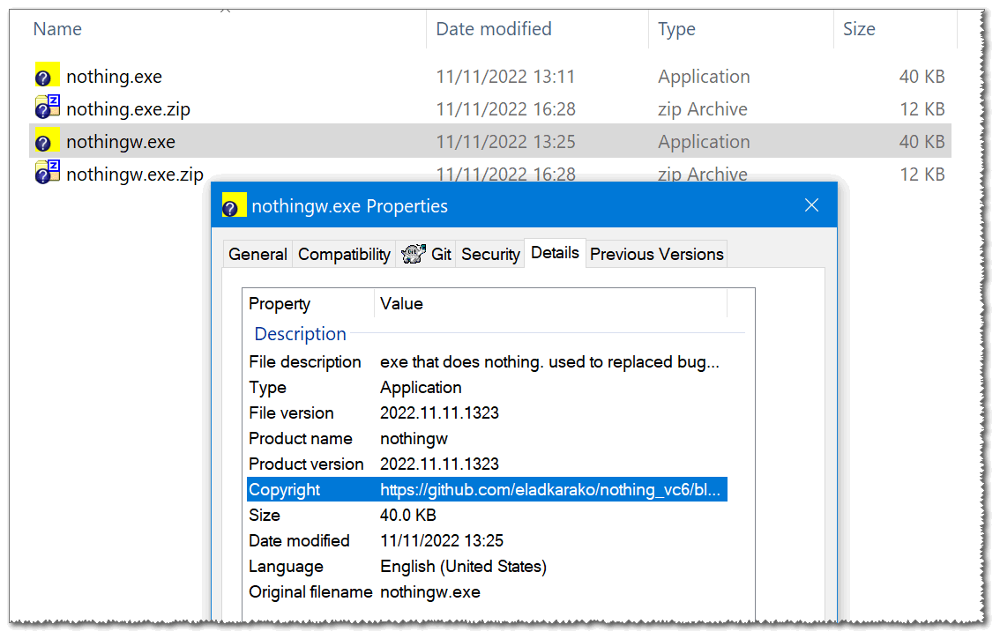

`nothing_vc6` is exe file that does nothing, built with Visual C++ 6.0SP6,  
for minimal dependencies (only `kernel.dll` which is available in every Windows).  

<a href="https://paypal.me/%65%31%61%64%6B%61%72%61%6B%30/%35%55%53%44" title="show your support"> ♥</a>

the main reason for this exe is replacing annoying exe,  
you can not really remove or prevent from running.  

`nothing` comes with two "flavors",  
`nothing.exe` and `nothingw.exe`.  
the rule-of-thumb is to use `nothingw.exe`.  

the difference is that `nothing.exe` is set to CONSOLE sub-system,  
which means it has some overhead when it opens - to get a "pipe" (stdout/stderr/stdin)  
from the OS. it also shows a console window when it runs by itself  
(for example when you run it from `explorer.exe` by double clicking it,  
if it runs from a batch file you obviously won't notice it..).

<h1>steps to nullify annoying exe on your system (tools)</h1>

<h3>step 1: identify 🔎 an annoying exe, and its running folder 📂.</h3>

- [sysinternals' process-explorer](https://en.wikipedia.org/wiki/Process_Explorer)  

<h3>step 2: renaming 📝 <code>annoying.exe</code> to something else</h3>

<code>annoying_original.exe</code> or <code>annoying.exe.original</code> (this way you won't launch it by mistake).  

- if not possible try to figure out what is locking the file using "Crystal-Rich's lockhunter".  
- if you can't unlock the file (for example a service you can not run locks it) you can try in Windows-Safe-Mode (or "power through" using [sysinternals' psexec](https://learn.microsoft.com/en-us/sysinternals/downloads/psexec) - explain below).  
- if nothing locks it, the file might be placed in a folder that is a restricted access, try changing ownership and add yourself as full control user, if that is not possible try open CMD as admin and use the `rename` or `move` commands.  
- some places are only accessible for "NT Authority System user" which is part of the OS, and normal admin permissions still won't work, in that case use [sysinternals' psexec](https://learn.microsoft.com/en-us/sysinternals/downloads/psexec) to launch a command line or file manager such as Total-Commander or FAR-Commander (or even CMD) as "NT Authority System user".  

<h3>step 3: rename ✅ <code>nothingw.exe</code> to ➡ <code>annoying.exe</code></h3>

(that's really the "TL;DR of it..")  
whatever executed the original <code>annoying.exe</code>, will try to do the same, but `nothingw.exe` (renamed to "`annoying.exe`") will do nothing other than quit.

developer notes

the VC6 compiled exe is not signed.  
I've also post-compile modified it with https://github.com/eladkarako/manifest  
to have a manifest that is compatible with Windows Vista,7,8,8.1,10,11,..  
it is a x86 that has been patched up to allow larger RAM allocation, as well as segmented stack (does not really matter though, it is just a good practice..).  
the fastest and minimalist project to create (while still valid) is a console (CONSOLE sub-system) application, which I've then copied the compiled exe and patched up to `nothingw.exe` with Windows GUI sub-system.

`bin_release` contains the exe binaries,  
`embedded_resources` contains the manifest, icon and VERSIONINFO embedded in both exe files,  
`source` includes the VC6 project as well (as a makefile which I didn't used).  

https://www.virustotal.com/gui/file/7f3fb63dcf0b66108dfa1b173c22b7ba67bd408ef6183924d7e306b489c553af  

https://www.virustotal.com/gui/file/747a8b57adc4ee79d48544d6eea1faef96b55edb7f25a02f74dbd0ced1dc2db1  

